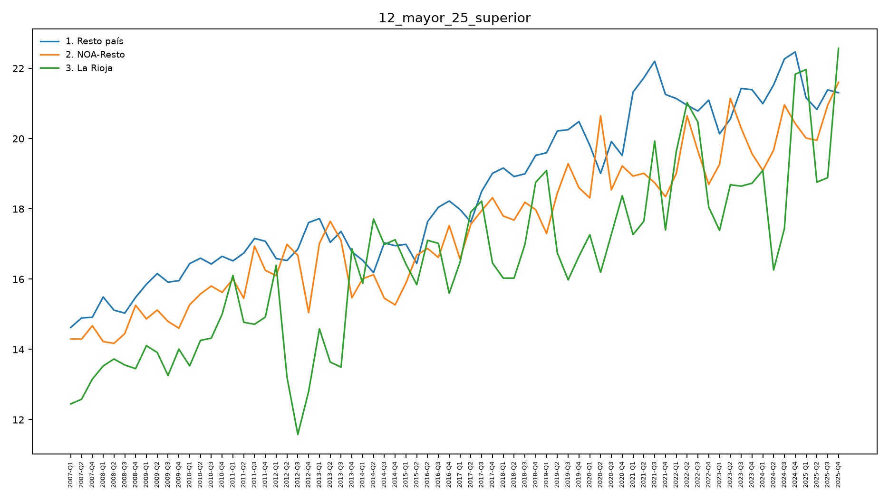
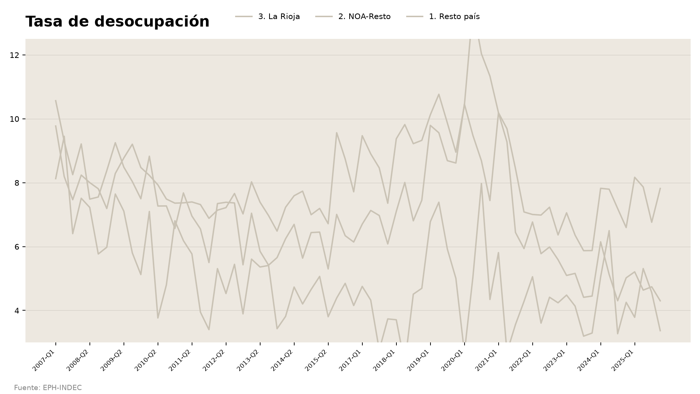

# Práctica - Clase 3

**Duración:** ~14 minutos en clase (el resto del material queda para hacer en casa; falta una
tercera parte — ver nota al final). **En parejas de perfiles mezclados.**

**El foco de esta práctica es leer, no escribir.** Las partes de acá abajo no piden completar
código: piden mirar un gráfico y decir qué está bien o mal, o leer un fragmento de `ggplot2` y
predecir qué dibuja antes de correrlo. Completar código (los `______` de siempre) queda como
refuerzo opcional para hacer en casa, al final de esta página.

---

## Parte 1 · Lectura de gráficos *(los dos, ~8')*

### 1a. Antes / después — el gráfico de líneas *(4')*

Es el mismo dato que usa el monitor (% de personas +25 con estudios superiores, por región), pero
dibujado sin ninguna de las decisiones de la clase 1. **No mires todavía el código ni el gráfico real.**



Contestá primero, solo mirando la imagen:

1. ¿Qué mide este gráfico? ¿Qué representa cada línea?
2. Nombrá al menos tres cosas que dificultan leerlo.
3. El título dice `12_mayor_25_superior`. ¿Ayuda a entender el hallazgo? ¿Por qué sí o no?

Ahora sí: abrí `outputs/plots/12_educ.png` (la versión real del monitor, mismo dato) y compará.
Para cada problema que nombraste en la pregunta 2, decí **qué decisión del código lo resuelve** —
no hace falta escribir la línea exacta, alcanza con nombrarla:

| Lo que viste mal en el "antes" | La decisión que lo arregla |
|---|---|
| Eje X con 76 etiquetas superpuestas | ¿...? |
| El eje Y no arranca en cero | ¿...? |
| Las tres líneas pesan igual, ninguna salta | ¿...? |
| El título es el nombre de una variable | ¿...? |

Si querés confirmar tus respuestas viendo el código real: `ejercicios/01_lineas_educacion.R`
(queda de refuerzo opcional, ver el final de esta página).

### 1b. Errores plantados — la tasa de desocupación *(4')*

Alguien lo armó para publicar, con la paleta y el estilo del monitor — pero tiene **dos errores de
integridad visual** metidos a propósito (de los que vimos en la clase 2 y en el Bloque A de hoy).
Encontralos **sin mirar el original todavía**.



1. Miren el eje Y. ¿Dónde arranca? ¿Qué efecto tiene eso sobre cómo se lee la caída de la
   desocupación a lo largo de la serie?
2. Traten de seguir la línea de La Rioja de punta a punta. ¿Se puede? ¿Por qué no?
3. Si tuvieran que pedir el arreglo en una revisión de código, ¿qué le dirían a quien lo hizo? (alcanza
   con nombrar la función o la decisión que falta — `ylim()`, un `factor()`, una paleta — no hace
   falta escribir el código completo)

Ahora comparen con el original: `outputs/plots/04_desoc.png`. ¿Encontraron los dos errores, o se
les pasó alguno? El código real que sí lo hace bien está en `src/04_desoc.R`.

> **Nota para quien dicta:** los errores plantados son (1) el eje Y recortado — va de 3 a 12,
> cuando el real arranca en 0 y llega a ~21, así que además recorta el pico de 2020 — y (2) las
> tres regiones en el mismo color pálido, con La Rioja dibujada *primero* y por lo tanto tapada
> donde las líneas se cruzan.

---

## Parte 2 · Predicción: leer código sin correrlo *(los dos, ~6')*

Estas cuatro tarjetas son variaciones del bump chart de PBG per cápita (`ejercicios/02_bump_pbg.R`).
**No hace falta correr nada.** Para cada una: escribí o decí en voz alta qué esperás que cambie en
el gráfico, **antes** de leer la respuesta.

**Tarjeta 1**

```r
rank_df <- prov %>%
  group_by(anio) %>%
  mutate(ranking = min_rank(desc(pbg_per_capita))) %>%
  ungroup()
```

**Predicción:** si borráramos estas tres líneas y graficáramos `pbg_per_capita` directo (sin pasar
por `ranking`), ¿qué eje Y tendría el gráfico? ¿Serviría igual para responder "en qué puesto está
La Rioja"?

<details><summary>Respuesta</summary>

El eje Y pasaría a ser el valor en pesos, no un puesto del 1 al 24. Se podría ver el *nivel* del PBG
per cápita de La Rioja en el tiempo, pero no si mejoró o empeoró *relativo a las demás* — que es la
pregunta que responde un bump chart.

</details>

**Tarjeta 2**

```r
ggplot(rank_df, aes(x = anio, y = ranking, group = provincia)) +
  geom_line()
```

**Predicción:** ¿en qué puesto del eje Y aparece dibujada la provincia con el PBG per cápita más
alto de cada año?

<details><summary>Respuesta</summary>

Sin `scale_y_reverse()`, `ggplot` dibuja el eje Y de forma creciente hacia arriba: el puesto 1 (el
más alto) queda **abajo**. La lectura sale al revés de lo que espera el ojo — "subir en el ranking"
se ve como bajar en el gráfico.

</details>

**Tarjeta 3**

```r
ggplot(rank_df, aes(x = anio, y = ranking, group = la_rioja_region, color = la_rioja_region)) +
  geom_line()
```

**Predicción:** ¿cuántas líneas hay dibujadas en este gráfico? (Pista: hay 24 provincias y 3 valores
posibles de `la_rioja_region`.)

<details><summary>Respuesta</summary>

Solo **3 líneas**, una por región — porque `group` agrupa las filas que se conectan en una misma
línea, y acá se agrupó por región en vez de por provincia. Las 24 trayectorias individuales se
pierden; lo que se ve es un promedio o una mezcla rara de las provincias de cada región. El
`group` correcto es `provincia` (24 líneas); el `color` sí puede ser `la_rioja_region` (3 colores).

</details>

**Tarjeta 4**

```r
ggplot(rank_df, aes(x = anio, y = ranking, group = provincia, color = la_rioja_region)) +
  geom_line(linewidth = 0.6)
```

**Predicción:** con las 24 líneas del mismo grosor, ¿se puede identificar de un vistazo cuál es la
de La Rioja?

<details><summary>Respuesta</summary>

Se puede si el color de "3. La Rioja" contrasta fuerte con el resto (la paleta del proyecto ya
ayuda), pero con las 21 provincias de contexto todas del mismo grosor, el gráfico sigue siendo
denso. Por eso el bump real suma `scale_linewidth_manual()`: contexto fino, La Rioja gruesa — el
patrón figura/fondo no depende solo del color.

</details>

---

## Parte 3 · *(pendiente)*

> **Nota para quien dicta:** el simulacro de actualización que iba acá (agregar una fila ficticia
> a un CSV, correr un script, revertir con `git checkout`) se sacó de la práctica. Falta una
> Parte 3 de reemplazo — conceptual sobre el pipeline, sin correr R en vivo — para completar los
> ~18' de práctica en clase.

---

## Para la puesta en común

- Los dos errores de la Parte 1b: ¿los encontraron los dos integrantes de la pareja, o cada uno vio
  uno distinto?
- Alguna predicción de la Parte 2 que les haya salido al revés de lo que esperaban — ¿por qué falló
  la intuición?
- Si llegaron al rastreo del pipeline (más abajo): en qué eslabón se les hizo menos obvio de dónde
  salía el número.

---

## Material para seguir en casa (opcional)

### Rastreo completo del pipeline

La versión larga del "de dónde sale este número", con rastreo guiado, diagrama a mano y auditoría
del CSV sin microdatos: **`ejercicios/02_rastreo_pipeline.R`** (~35' si lo hacés completo — B1
rastreo, B2 diagrama, B3 auditoría). Elegí como punto de partida cualquiera de los CSV que vieron
hoy (`04_tasa_desoc.csv` de la Parte 1b es un buen candidato) y seguile el rastro hasta la fuente
cruda. Solución: `soluciones/02_rastreo_respuestas.md`.

### Practicar la sintaxis de ggplot2 (fill-in-the-blank)

Para quien quiera reforzar completando código de verdad, ahora con el contexto de lo que ya
interpretaron en las Partes 1 y 2:

- **`ejercicios/01_lineas_educacion.R`** — reconstruye `src/12_educ.R` sobre
  `12_mayor_25_superior.csv`, el mismo dato de la Parte 1a. Solución:
  `soluciones/01_lineas_educacion.R`.
- **`ejercicios/02_bump_pbg.R`** — la versión completa (con código real, no solo predicción) del
  bump chart de la Parte 2. Solución: `soluciones/02_bump_pbg.R`.
  > ⚠️ Al día de hoy `data/inputs_md/15_pbg_per_capita_por_provincia.csv` (el CSV que lee este
  > ejercicio) todavía no está en el repo — avisale a quien dicta la clase antes de intentar
  > correrlo.

### Agregar un indicador nuevo de punta a punta

El recorrido completo del circuito —calcular un indicador que hoy no existe, graficarlo y abrir el
PR— está en el `practica.Rmd`, sección "Variante avanzada". El indicador es la **tasa de
actividad** (PEA sobre población total), derivable de dos CSV ya versionados.
